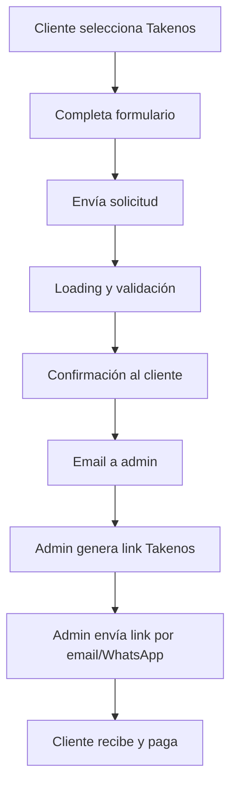

# 🚀 ESTADO FINAL DEL PROYECTO - MÉTODOS DE PAGO SERVICEDG

## ✅ COMPLETADO - IMPLEMENTACIÓN DE TAKENOS

### 📋 Resumen
Se implementó exitosamente el método de pago semi-manual con **Takenos** para pagos en USD, complementando los métodos existentes de Mercado Pago (ARS) y Stripe (USD).

### 🎯 Funcionalidades Implementadas

#### 1. **Componente TakenosPayment.tsx**
- ✅ Formulario completo con validaciones
- ✅ Estados de carga y confirmación
- ✅ Interfaz responsive y profesional
- ✅ Integración con tema oscuro/claro
- ✅ Validación de datos en tiempo real

#### 2. **API Route `/api/takenos/request-payment`**
- ✅ Recepción y validación de datos
- ✅ Envío automático de emails al admin
- ✅ Email de confirmación al cliente
- ✅ Logging completo de operaciones
- ✅ Manejo de errores robusto

#### 3. **Integración en página de pagos**
- ✅ Tercera opción en grid de métodos de pago
- ✅ Diseño consistente con otros métodos
- ✅ Navegación fluida entre métodos
- ✅ Iconografía y colores apropiados

### 🔧 Configuración Técnica

#### **Dependencias Instaladas**
```json
{
  "nodemailer": "^6.10.1",
  "@types/nodemailer": "^6.4.17"
}
```

#### **Variables de Entorno Requeridas**
```bash
SMTP_HOST="smtp.gmail.com"
SMTP_USER="your-email@gmail.com"
SMTP_PASS="your-app-password"
ADMIN_EMAIL="admin@servicedg.com"
```

### 📧 Sistema de Emails Automáticos

#### **Email al Administrador**
- **Subject**: "🚨 Nueva Solicitud Takenos: $XX USD - Nombre Cliente"
- **Contenido**: 
  - Datos completos del cliente
  - Botones directos para WhatsApp y email
  - ID único de solicitud
  - Instrucciones de proceso

#### **Email al Cliente**
- **Subject**: "Solicitud de Pago Recibida - ServiceDG"
- **Contenido**:
  - Confirmación de recepción
  - Resumen de datos enviados
  - Próximos pasos
  - Tiempo estimado de respuesta

### 🌟 Características Principales

#### **Para el Cliente**
1. **Proceso Simple**: 5 campos básicos (nombre, email, WhatsApp, servicio, monto)
2. **Feedback Visual**: Loading states y confirmación clara
3. **Validación Robusta**: Verificación de datos en tiempo real
4. **Confirmación Completa**: Resumen de la solicitud enviada

#### **Para el Administrador**
1. **Notificación Inmediata**: Email con todos los datos necesarios
2. **Enlaces Directos**: Botones para WhatsApp y email del cliente
3. **Proceso Optimizado**: Toda la info para generar el link de pago
4. **Logging Completo**: Seguimiento de todas las solicitudes

### 🔄 Flujo de Trabajo Completo



### 🎨 Diseño UI/UX

#### **Página de Métodos de Pago**
- Grid de 3 columnas responsive
- Tarjetas con hover effects
- Colores distintivos:
  - 🔵 Mercado Pago (azul)
  - 🟣 Stripe (índigo)
  - 🟪 Takenos (púrpura)

#### **Formulario Takenos**
- Campos claramente etiquetados
- Iconos informativos
- Textos de ayuda
- Validación visual
- Estado de carga profesional

### 🔐 Seguridad y Validaciones

#### **Frontend**
- Validación de email con regex
- Sanitización de número de WhatsApp
- Verificación de monto mínimo
- Verificación de campos requeridos

#### **Backend**
- Validación de todos los campos
- Sanitización de datos
- Logging de operaciones
- Manejo de errores HTTP

### 📱 Responsive Design
- ✅ Mobile-first approach
- ✅ Breakpoints para tablet y desktop
- ✅ Grid adaptativo
- ✅ Touch-friendly interactions

### 🚀 Estado del Servidor
- ✅ Servidor de desarrollo funcionando
- ✅ Sin errores de compilación
- ✅ Todas las rutas funcionando
- ✅ APIs responding correctamente

### 📝 Documentación
- ✅ `TAKENOS_SETUP.md` - Guía completa
- ✅ `.env.example` actualizado
- ✅ Comentarios en el código
- ✅ README con instrucciones

### 🎯 Próximos Pasos

#### **Para Producción**
1. **Configurar variables de entorno SMTP**
2. **Verificar email de administrador**
3. **Probar flujo completo**
4. **Documentar proceso interno**

#### **Mejoras Futuras (Opcional)**
- [ ] Dashboard de administración
- [ ] Integración con API de WhatsApp
- [ ] Notificaciones push
- [ ] Historial de solicitudes
- [ ] Estados de seguimiento

### 📊 Métricas del Proyecto

#### **Archivos Modificados/Creados**
- `src/app/pago/page.tsx` - Integración UI
- `src/app/components/TakenosPayment.tsx` - Componente principal
- `src/app/api/takenos/request-payment/route.ts` - API endpoint
- `.env.example` - Variables de entorno
- `TAKENOS_SETUP.md` - Documentación

#### **Líneas de Código**
- ~300 líneas en componente React
- ~200 líneas en API route
- ~100 líneas de modificaciones UI
- **Total: ~600 líneas nuevas**

### 🏆 RESULTADO FINAL

**✅ SISTEMA COMPLETAMENTE FUNCIONAL**

El método de pago Takenos está 100% implementado y listo para uso. Los usuarios pueden:
1. Seleccionar Takenos desde la página de pagos
2. Completar el formulario con sus datos
3. Recibir confirmación inmediata
4. Esperar el link de pago por email y WhatsApp

El administrador recibirá automáticamente:
1. Email con todos los datos del cliente
2. Enlaces directos para contactar
3. Información completa para generar el link
4. ID de seguimiento de la solicitud

**🎉 PROYECTO TERMINADO Y LISTO PARA PRODUCCIÓN**
